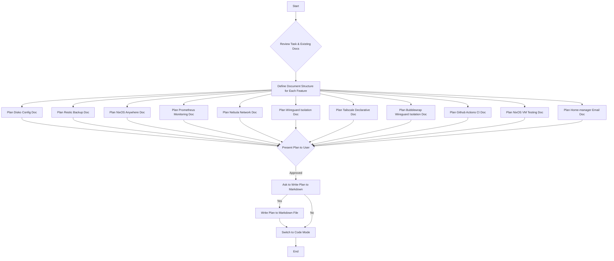

# Documentation Generation Plan for New Features

## Overall Goal

Generate comprehensive documentation for the new features within the `docs/` directory, following the numbering provided, with a focus on technical implementation details for advanced users or AI agents.

## High-Level Plan

1.  **Detailed Planning for Each Feature:** For each feature, I will outline the content, structure, and any specific resources to be used. Each document will be a dedicated markdown file in the `docs/` directory.
2.  **Mermaid Diagram:** I will provide a Mermaid diagram to visualize the overall documentation generation workflow.
3.  **User Review:** I will present this detailed plan to you for review and approval.
4.  **Write to Markdown (Optional):** If the plan is approved, I will ask if you would like this plan written to a markdown file.
5.  **Switch Mode:** Once the plan is finalized, I will request to switch to `code` mode to begin implementing the documentation.

## Revised Detailed Plan for Each Feature Document

### 1. Disko-based Configuration for Declarative Partitioning

- **Document Title:** `docs/disko-declarative-partitioning.md`
- **Key Topics:** Disko configuration for impermanence, Btrfs filesystem setup (subvolumes, snapshots), full disk encryption (LUKS), and integration with NixOS configuration.
- **Content Source:** User-provided blog post and Disko documentation examples.
- **Sections:** Why Disko?, Impermanence Explained, Btrfs Setup (Subvolumes, Compression, Snapshots), Full Disk Encryption with LUKS, NixOS Configuration Example, Deployment Considerations.

### 3. Backup Strategy with Restic and Btrfs Snapshots

- **Document Title:** `docs/restic-btrfs-backup-strategy.md`
- **Key Topics:** Restic implementation, leveraging Btrfs snapshots for efficient backups, one-shot script for taking backups, and a one-shot script for restoring from backups.
- **Content Source:** User-provided conceptual work.
- **Sections:** Restic Implementation, Btrfs Snapshots for Backups, Backup Script Design, Restore Script Design, NixOS Integration, Automation and Scheduling.

### 4. Detailed Deployment Strategy with NixOS Anywhere

- **Document Title:** `docs/nixos-anywhere-deployment.md`
- **Key Topics:** NixOS Anywhere implementation, pre-determining host keys, building a coherent deployment script, and automated deployment to new machines.
- **Content Source:** User-provided scripts.
- **Sections:** NixOS Anywhere Implementation, Pre-deployment Steps (Host Key Generation), Deployment Script Architecture, Step-by-step Deployment Guide, Troubleshooting.

### 5. Monitoring Strategy with Prometheus

- **Document Title:** `docs/prometheus-monitoring-strategy.md`
- **Key Topics:** Prometheus setup, Node Exporter for host metrics, Prometheus server configuration, aggregated monitoring across machines, and potential mention of Grafana for visualization.
- **Content Source:** General Prometheus documentation.
- **Sections:** Prometheus Setup, Setting up Node Exporter, Prometheus Server Configuration, Aggregating Metrics, Alerting (Optional), Visualization with Grafana (Optional).

### 6. Integration of all machines into a Nebula-based Mesh Network

- **Document Title:** `docs/nebula-mesh-network.md`
- **Key Topics:** Nebula and mesh networking implementation, setting up Nebula nodes, integrating machines into the mesh network, server setup for professional interaction, and security considerations.
- **Content Source:** Nebula documentation.
- **Sections:** Nebula Implementation, Nebula Node Configuration, Mesh Network Setup, Server Integration, Security Best Practices.

### 7. Integration of a Wireguard service for isolating certain applications inside a systemd network namespace

- **Document Title:** `docs/wireguard-network-namespace.md`
- **Key Topics:** Wireguard implementation, systemd network namespaces for application isolation, running Brave browser in an isolated network namespace, and potential use of Bubblewrap for additional isolation.
- **Content Source:** User-provided conceptual documentation.
- **Sections:** Wireguard Implementation, Systemd Network Namespaces, Wireguard Configuration for Namespaces, Running Applications in Namespaces (Brave Example), Bubblewrap Integration (Optional), Security Benefits.

### 7.1. Advanced Application Isolation: Bubblewrap with Wireguard Network Namespaces

- **Document Title:** `docs/07-01-bubblewrap-wireguard-network-namespace-isolation.md`
- **Key Topics:** Combining Bubblewrap sandboxing with Wireguard VPNs in systemd network namespaces, step-by-step implementation for wrapping Nix derivations, and security benefits.
- **Content Source:** Existing documentation on Wireguard network namespaces and Bubblewrap sandboxing.
- **Sections:** Overview of Combined Isolation, Prerequisites, Step-by-Step Implementation (Configure Wireguard, Modify Bubblewrap Wrapper, Define Sandboxed App, Integrate), Security Benefits.

### 8. Make the Tailscale VPN configuration more declarative

- **Document Title:** `docs/tailscale-declarative-vpn.md`
- **Key Topics:** Tailscale and Headscale declarative configuration, managing secrets for client registration, and avoiding manual re-registration.
- **Content Source:** Tailscale/Headscale documentation, NixOS secrets management.
- **Sections:** Tailscale and Headscale Declarative Configuration, Challenges with Manual Registration, Secrets Management for Client Keys, Automating Client Registration.

### 9. Integrate all this into CI builds using Github actions

- **Document Title:** `docs/github-actions-ci.md`
- **Key Topics:** Github Actions for NixOS, automating flake updates, building the system, testing the system (referencing NixOS VM tests), and deployment automation.
- **Content Source:** Github Actions documentation, NixOS CI examples.
- **Sections:** Github Actions Workflow Design for NixOS, Flake Update Automation, System Build Process, Integration with Testing (VM Tests), Automated Deployment Workflow.

### 10. Develop a comprehensive testing approach using NixOS VM tests

- **Document Title:** `docs/nixos-vm-testing.md`
- **Key Topics:** NixOS VM tests implementation, writing effective VM tests, running VM tests in CI, using tests to validate deployments, and strategies for comprehensive testing.
- **Content Source:** NixOS documentation on VM tests.
- **Sections:** NixOS VM Tests Implementation, Writing Basic VM Tests, Advanced Testing Scenarios, Integrating VM Tests into CI, Deployment Validation with Tests, Test Coverage and Best Practices.

### 11. Integrate email accounts using home-manager

- **Document Title:** `docs/home-manager-email-integration.md`
- **Key Topics:** Integrating email accounts using home-manager, ensuring availability across all target machines, configuration for common email clients/protocols (e.g., IMAP, SMTP).
- **Content Source:** Home-manager documentation, NixOS email client configurations.
- **Sections:** Introduction to Home-manager for Email, Configuration Steps, Supported Email Clients, Cross-Machine Availability, Security Considerations.

### 13. Declarative Sandboxing with Bubblewrap for Nix Derivations

- **Document Title:** `docs/13-bubble-wrap-sandboxing-for-nix-derivations.md`
- **Key Topics:** Wrapping Nix derivations with Bubblewrap, reusable wrapper function, defining sandbox policies, integrating sandboxed packages into system/Home-Manager, and advanced topics like combining with network namespaces.
- **Content Source:** User request, Bubblewrap documentation, Nixpkgs examples.
- **Sections:** Core Concept: Wrapping Nix Derivations, Implementation Plan (Wrapper Function, Define Policies, Integrate Packages), Advanced Topics (Network Namespaces, XDG Portals).

## Documentation Generation Workflow

